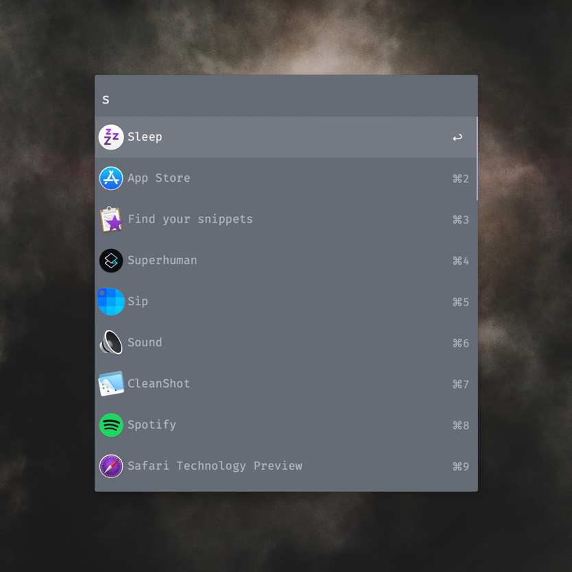
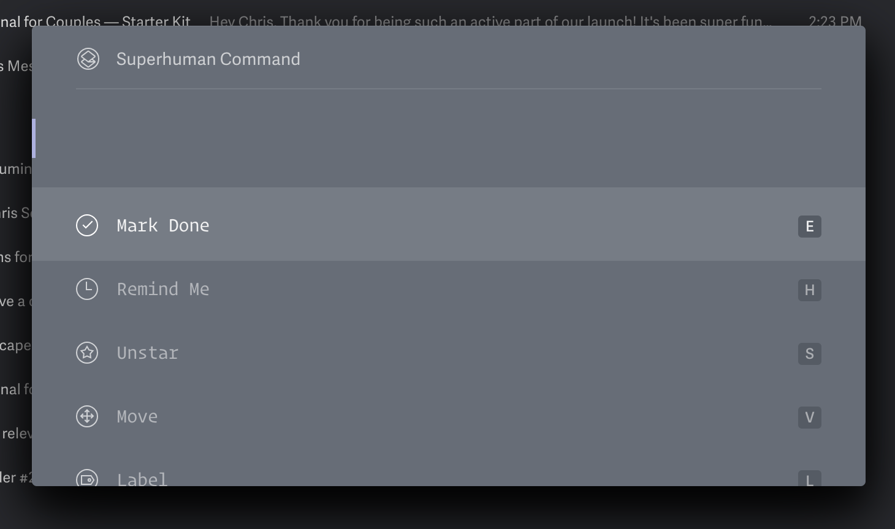

  

# Alfred Powerpack Themes

Here are two Alfred Powerpack Themes that are based on the Superhuman
email client color scheme. 

[Superhuman](https://superhuman.com/) is a premium front-end for Gmail and
is considered the fastest email experience ever made.

## Installation

Download the preferred theme below and then double-click the .alfredappearance file to install it.

## Tips

Disable the Alfred hat logo by unchecking: `Alfred Preferences > Appearance > Options > Hide hat on Alfred window`

Disable result shortcuts by unchecking: : `Alfred Preferences > Appearance > Options > Hide result shortcuts`

Simplify results by switching the result subtext to "Only for Alternative Actions"`.

This theme makes use of the open source <a href="https://github.com/tonsky/FiraCode/">Fira Code font</a>. <a href="https://github.com/tonsky/FiraCode/releases">Download it here</a>.

## Previews

### Superhuman Light

  

  <a href="Superhuman%20Light.alfredappearance">
    Download - Superhuman Light Theme
  </a>

### Superhuman Carbon

  

  <a href="Superhuman%20Carbon.alfredappearance">
    Download - Superhuman Carbon Theme
  </a>

## Source

These are screenshots from Superhuman from which this theme is derived. Superhuman uses a custom 
version of the Operator Mono Book font.

### Superhuman Light

  

### Superhuman Carbon

  

