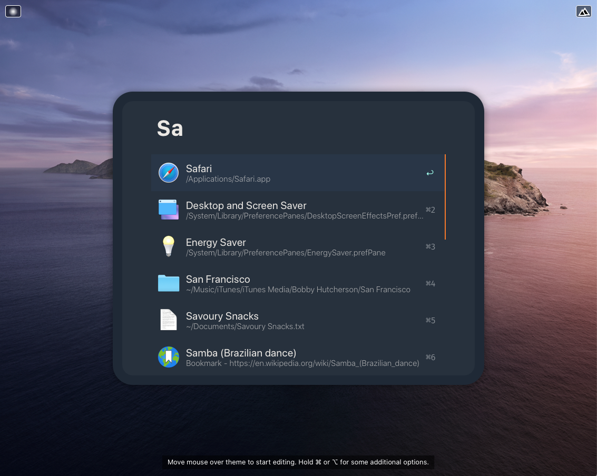
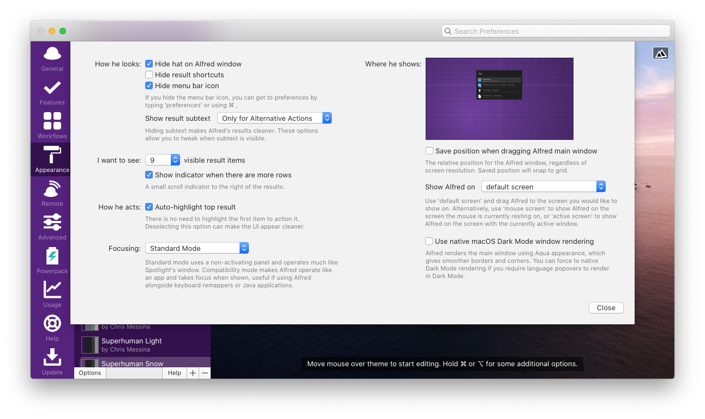
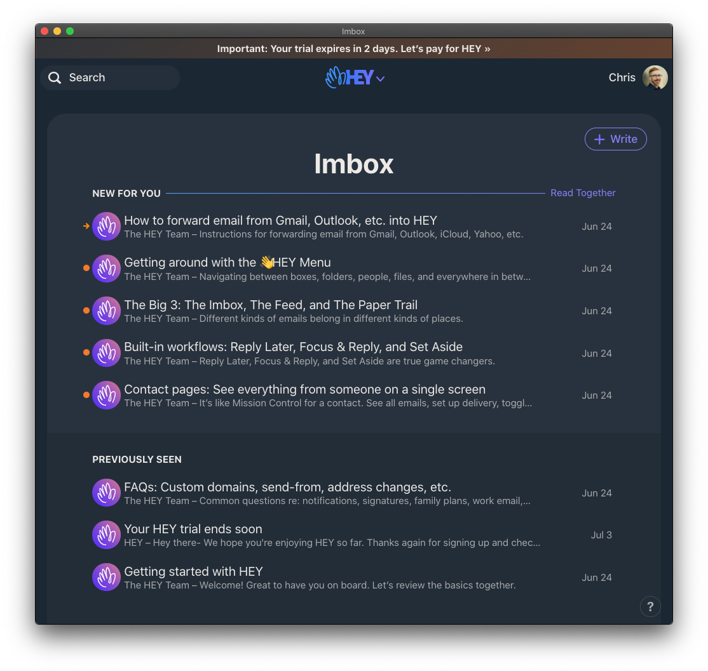

# Hey Powerpack Theme

Here are two [Alfred Powerpack Themes](https://www.alfredapp.com/help/appearance/) that are based on [Hey](https://hey.com/), a new take on email from Basecamp.

[Discuss on Alfred Forum](https://www.alfredforum.com/topic/15214-hey-email-inspired-themes/).

  <a href="https://github.com/chrismessina/alfred-app/raw/master/themes/hey/hey-themes.zip" class="button">
    Download Themes
  </a>

## Installation

Download your preferred theme below, unzip the file, and then double-click the `.alfredappearance` file to install it.

This theme makes use of Apple's [San Francisco font](https://developer.apple.com/fonts/). [Download it here](https://developer.apple.com/design/downloads/SF-Font-Pro.dmg).

## Previews

### Hey Theme (Light)

  <a href="https://github.com/chrismessina/alfred-app/raw/master/themes/hey/hey-light-light.zip" class="button">
    Download - Hey Theme (Light)
  </a>

### Hey Theme (Dark)

  <a href="https://github.com/chrismessina/alfred-app/raw/master/themes/hey/hey-light-dark.zip" class="button">
    Download - Hey Theme (Dark)
  </a>

## Suggested configuration

Disable the Alfred hat logo by unchecking: `Alfred Preferences › Appearance › Options › Hide hat on Alfred window`

Disable result shortcuts by unchecking: : `Alfred Preferences › Appearance › Options › Hide result shortcuts`

Simplify results by switching the result subtext to "Only for Alternative Actions".

## Inspiration

These are the Hey interfaces from which this theme is derived.

### Hey Light Theme

### Hey Dark Theme

## About

These themes are unaffiliated with nor endorsed by Basecamp.
