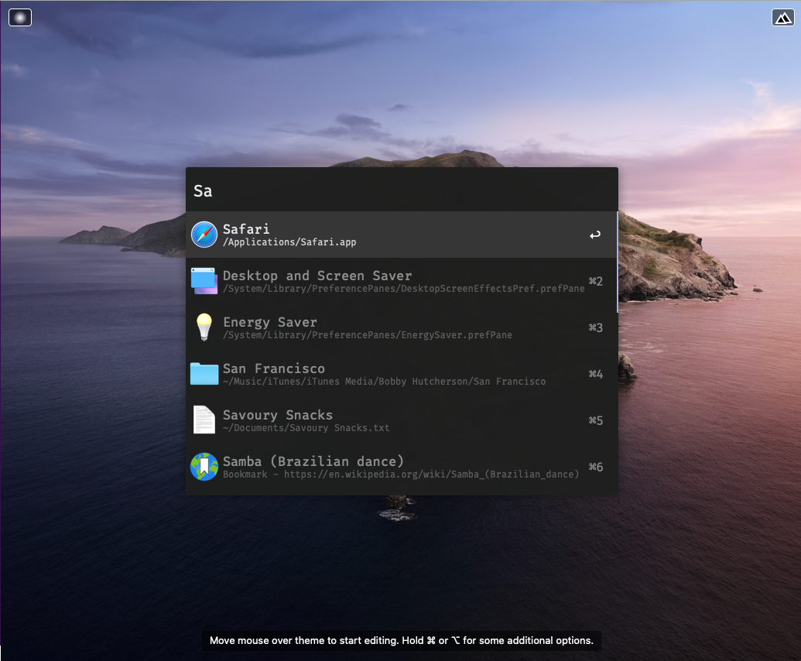
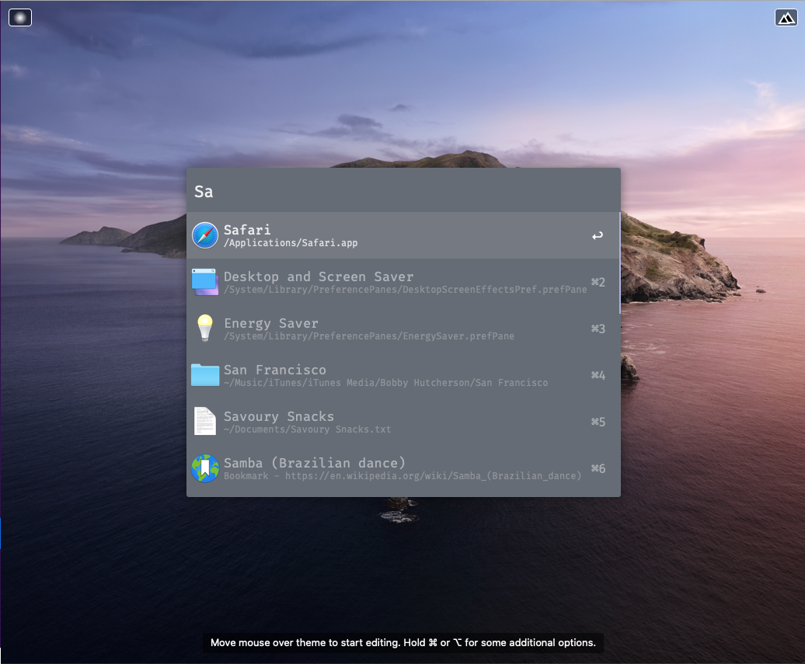

# Superhuman Powerpack Themes

Here are two [Alfred Powerpack Themes](https://www.alfredapp.com/help/appearance/) that are based on the Superhuman email client color schemes.

[Superhuman](https://superhuman.com/) is a premium front-end for Gmail and is considered the fastest email experience ever made.

  <a href="https://github.com/chrismessina/alfred-app/raw/master/themes/superhuman/Superhuman%20Themes%20for%20Alfred.zip" class="button">
    Download Themes
  </a>

## Installation

Download your preferred theme below, unzip the file, and then double-click the `.alfredappearance` file to install it.

This theme makes use of the open source [Fira Code font](https://github.com/tonsky/FiraCode/). [Download it here](https://github.com/tonsky/FiraCode/releases).

## Previews

### Superhuman Snow

  <a href="https://github.com/chrismessina/alfred-app/raw/master/themes/superhuman/Superhuman%20Snow.zip" class="button">
    Download - Superhuman Snow Theme
  </a>

### Superhuman Carbon

  <a href="https://github.com/chrismessina/alfred-app/raw/master/themes/superhuman/Superhuman%20Carbon.zip" class="button">
    Download - Superhuman Carbon Theme
  </a>

## Suggested configuration

Disable the Alfred hat logo by unchecking: `Alfred Preferences › Appearance › Options › Hide hat on Alfred window`

Disable result shortcuts by unchecking: : `Alfred Preferences › Appearance › Options › Hide result shortcuts`

Simplify results by switching the result subtext to "Only for Alternative Actions".

## Inspiration

These are screenshots from Superhuman from which this theme is derived. Superhuman uses a custom
version of the [Operator Mono Book font](https://www.typography.com/fonts/operator/styles/operatormono).

### Superhuman Snow

### Superhuman Carbon

# About

These themes are unaffiliated with nor endorsed by Superhuman.

# Contact

This theme was created by [Chris Messina](https://chrismessina.me).

You can contact him via [Twitter](https://twitter.com/@chrismessina) or [his website](https://chrismessina.me/contact).

☕ You can [tip him with a coffee](https://ko-fi.com/chris).
