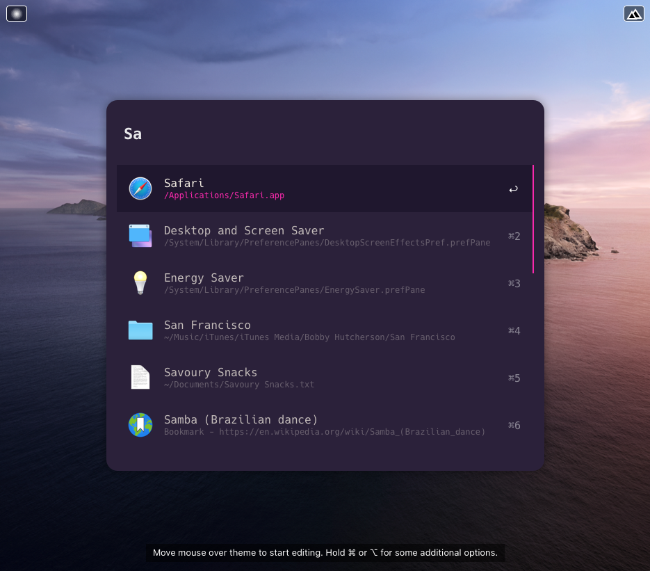
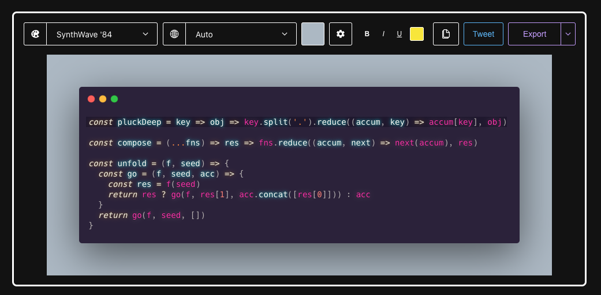

# Synthwave 84 Powerpack Theme

Here is an [Alfred Powerpack Theme](https://www.alfredapp.com/help/appearance/) based on [Synthwave '84](https://robbowen.digital/wrote-about/synthwave-84/), an experimental Visual Studio theme influenced "by the music and the cover artwork of modern Synthwave bands like FM-84, Timecop 1983 and The Midnight".

  <a href="https://github.com/chrismessina/alfred-app/raw/master/themes/synthwave-84/Synthwave%2084.alfredappearance" class="button">
    Download Theme
  </a>

## Installation

Download the `.alfredappearance` theme file below and then double-click to install it.

This theme makes use of Source Foundry's [Hack](https://github.com/source-foundry/Hack) font. [Download it here](https://sourcefoundry.org/hack/).

## Preview

  <a href="https://github.com/chrismessina/alfred-app/raw/master/themes/synthwave-84/Synthwave%2084.alfredappearance" class="button">
    Download Theme
  </a>

## Suggested configuration

Disable the Alfred hat logo by unchecking: `Alfred Preferences › Appearance › Options › Hide hat on Alfred window`

Disable result shortcuts by unchecking: : `Alfred Preferences › Appearance › Options › Hide result shortcuts`

Simplify results by switching the result subtext to "Only for Alternative Actions".

## Inspiration

This theme was [originally requested](https://www.alfredforum.com/topic/15740-a-theme-inspired-by-the-1980s-like-synthwave-84-for-vs-code/) by [austriker](https://www.alfredforum.com/profile/19702-austriker/) in the Alfred Forum. These interfaces were used as inspiration:

### VS Code Theme

### Carbon

## About

This theme is unaffiliated with nor endorsed by Rob Bowen.
