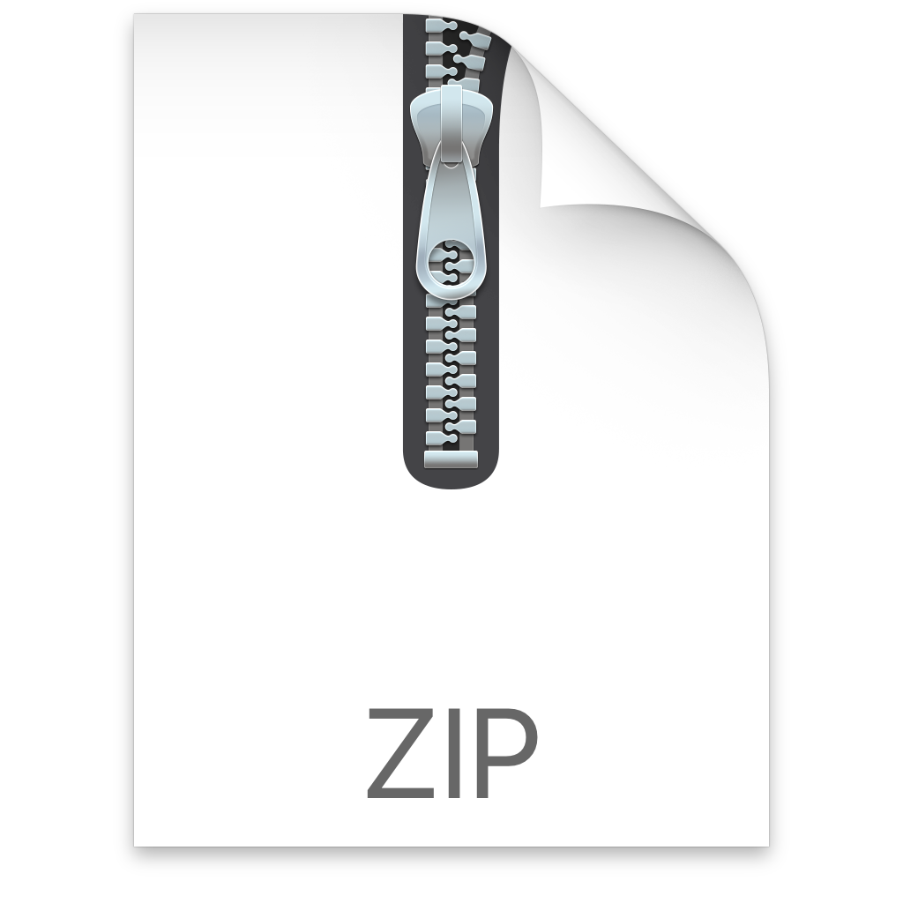
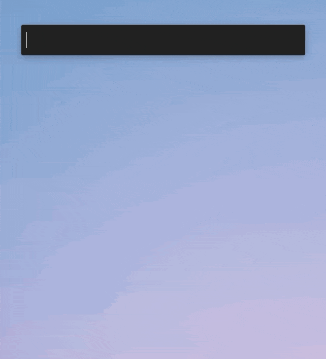

# .New Cloud Documents for Alfred

[.new](https://whats.new/) is a domain extension exclusively for performing new actions online: any act that leads to creation can have a quick and memorable .new shortcut associated with it.

This Alfred Workflow allows you to quickly create new cloud documents simply by invoking the 'new' keyword, a space, and then selecting from the list of available options.

# Installation

1. Download and unzip [this file](https://github.com/chrismessina/alfred-app/raw/master/workflows/new-cloud-documents/dot-new-alfred-workflow.zip).
2. Double-click `dot-new-alfred-workflow.alfredworkflow` to install it.

_You will need to be an [Alfred Powerpack](https://www.alfredapp.com/powerpack/) user to enable this workflow._

# Usage

Activate Alfred and type `new`. You can then select from a list of existing .new cloud documents (with a few bonuses thrown in):

Among the list of services included:

* Anchor: `episode`, `podcast`
* Adobe: `compresspdf`, `create`, `pdf`, `sign`, `spark`
* Asana: `task`
* Bitly: `bitly`, `link`
* Canva: `canva`, `design`
* Coda: `coda`
* CodeSandbox: `csb`, `js`, `ng`, `ts`, `react`, `vue`
* Discord: `discord`
* eBay: `sell`
* Google Calendar: `cal`, `meeting`
* Google Docs: `doc`, `docs`
* Google Drawings: `drawing`
* Google Forms: `form`, `forms`
* Google Keep: `keep`
* Google Slides: `slide`, `slides`
* Google Sheets: `sheet`, `sheets`
* Github: `gist`, `repo`
* Medium: `medium`, `story`
* Prezi: `prezi`
* Product Hunt: `hunt`
* Runkit:`api`
* Shopify: `shopify`
* Spotify: `playlist`
* Stripe: `invoice`, `subscription`
* Webex: `letsmeet`, `webex`
* WIP: `todo`

## Customizing

You can add new services to the workflow simply by adding a new shortcut to the List Filter that includes a Title, Subtitle, and argument (i.e. the URL used to create a new document). An icon is optional, but preferable.

# Changelog[¹](https://keepachangelog.com/)

## [0.2.1] - 2020-08-08

### Changed
- Removed optional argument configuration

## [0.2.0] - 2020-08-06

### Added
- Added support for [CodeSandbox](https://codesandbox.io/)[1](https://twitter.com/compuives/status/1291020566221205511?s=21) and [WIP](https://wip.chat/) shortcuts (h/t [Nathan Gathright](https://nathangathright.com/))
- Added another dozen or so of recently added services.

## [0.1.1] - 2020-06-08

### Added
- Added Workflow description and add link to homepage.

## [v0.1.0] - 2020-06-05
- Initial Release

# About

This workflow is unaffiliated with nor endorsed by the [Google Domain Registrar](https://www.registry.google/).

You can [file bugs](https://github.com/chrismessina/alfred-app/issues/new) or [submit feature requests](https://github.com/chrismessina/alfred-app/issues/new) on GitHub using the label `workflow:new-cloud-documents`.

# Contact

This workflow was created by [Chris Messina](https://chrismessina.me).

You can contact him via [Twitter](https://twitter.com/@chrismessina) or [his website](https://chrismessina.me/contact).

☕ You can [tip him with a coffee](https://ko-fi.com/chris).
