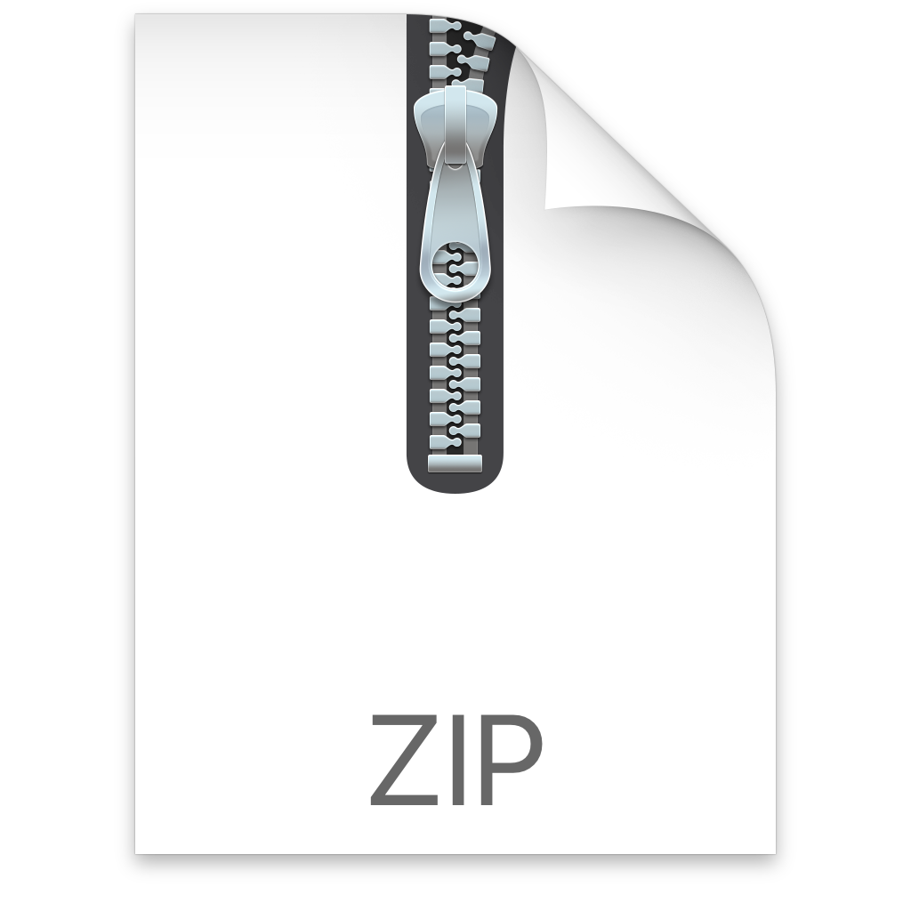

# Twitter Toolkit for Alfred

The Twitter Toolkit for Alfred is a set of keywords that let you quickly interact with Twitter's website and [Mac app](https://apps.apple.com/us/app/twitter/id1482454543?mt=12&uo=4).

It makes it easy to quickly search and find your own content or the content of people you follow (shown using my <a href="../../themes/hey">Hey Theme</a>):

Please note that this extension doesn't support programmatic access to Twitter. For that kind of integration, try [AlfredTweet](http://dferg.us/alfredtweet-2/) by David Ferguson.

# Installation

1. Download and unzip [this file](https://github.com/chrismessina/alfred-app/raw/master/workflows/twitter-toolkit/twitter-toolkit.zip).
2. Double-click `twitter-toolkit.alfredworkflow` to install it.

_You will need to be an [Alfred Powerpack](https://www.alfredapp.com/powerpack/) user to enable this workflow._

# Configuration

## Integration with Twitter for Mac

This workflow supports interacting with Twitter on the web or in the Twitter for Mac app. Unfortunately, the desktop app doesn't support that many intents and will fall back to the web in those cases.

To enable integration with the Twitter for Mac app:

1. After you've installed the workflow, go to Workflows and select Twitter Toolkit
2. Access the workflow and variables configuration [here](./assets/workflow-variables.png):

3. Set the `platform` variable in [the configuration](./assets/workflow-config.png) to `app` ➊ (to disable this integration, just set the 'platform' variable to `web`).

## Set your username

This workflow also makes it easy to search your own tweets or find content from the people you follow ("followees"). To configure this feature, you must set the `account` variable in the configuration ➋.

# Keywords

Look for the  symbol below to see which keywords will open with Twitter for Mac when `platform` is set to `app`.

**tweet **

Compose new Tweet (use with a space to compose your tweet)

**follow **

Follow {query} on Twitter

**explore or trending **

See what’s happening

**tweets **

Search Twitter for {query} 
⌘ Search my tweets for {query} 
Search tweets from people I follow for {query}

**my**

Search my tweets for {query} 
Search my tweets for #{query} 
Search people I follow for {query}
View my Twitter Bookmarks
View my Twitter Lists
View my Twitter Moments
View my Twitter Notifications
View my Twitter Topics

**me **

View my profile on Twitter

**#**

Search Twitter for #{query} 
⌘ Search my tweets for #{query}

**@ **

Go to Twitter user @{query} 
Search Twitter for @{query}

**images**

Search Twitter images for {query} 
⌘ Search my Twitter images for {query}

**videos**

Search Twitter videos for {query} 
⌘ Search my Twitter videos for {query}

**users**

Search Twitter users for {query}

**dm **

Compose a Twitter message

**dms **

Go to Twitter messages

**embed**

Get embed code for a tweet (requires link to tweet)

**analytics**

Go to Twitter Analytics

**help**

Go to Twitter Help Center

**media studio**

Go to Twitter Media Studio

**notifs**

View my Twitter Notifications

# Changelog[¹](https://keepachangelog.com/)

## [v0.2.0] - 2020-08-17
### Added
- All new icons!
- Support for new keywords: `analytics`, `explore`, `help`, `media`, `notifs`
- New additions to the "my" collection: Bookmarks, Lists, Moments, Notifications

## [v0.1.0] - 2020-08-06
- Initial Release

# About

This workflow is unaffiliated with nor endorsed by Twitter.

You can [file bugs](https://github.com/chrismessina/alfred-app/issues/new) or [submit feature requests](https://github.com/chrismessina/alfred-app/issues/new) on GitHub using the label `workflow:twitter-toolkit`.

# Contact

This workflow was created by [Chris Messina](https://chrismessina.me).

You can contact him via [Twitter](https://twitter.com/@chrismessina) or [his website](https://chrismessina.me/contact).

☕ You can [tip him with a coffee](https://ko-fi.com/chris).
